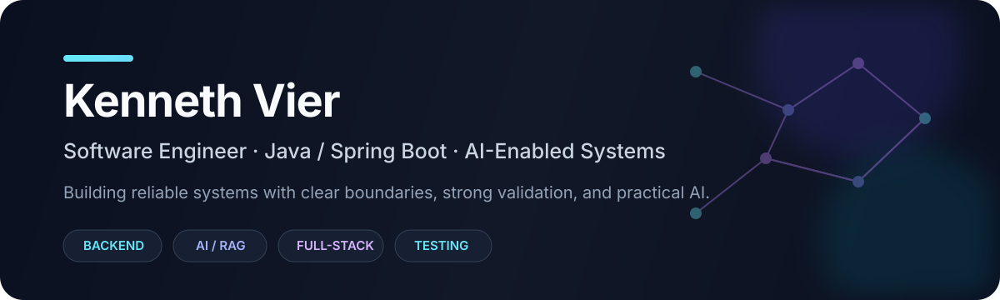

<div align="center">



[](https://vier-main-portfolio.vercel.app)
[](https://github.com/KennethVier)

</div>

## Engineering Profile

I'm a **Software Engineer** focused on backend-heavy full-stack systems with **Java, Spring Boot, React, PostgreSQL, and AI integration**.

I care about the parts of software that tend to matter after the demo works: **clear architecture, transactional correctness, concurrency, validation, migrations, testability, security boundaries, observability, and maintainability**.

My current direction sits at the intersection of traditional software engineering and AI engineering—building systems where LLMs are bounded components rather than the architecture itself.

```text
Product problem
    ↓
Domain + architecture
    ↓
Reliable backend / data boundaries
    ↓
AI where it adds leverage
    ↓
Validation, testing, observability
```

---

## Featured Engineering Projects

### 🧠 [Hippocampus](https://github.com/KennethVier/hippocampus)

**Medical learning platform built around evidence-grounded Study Missions.**

Hippocampus is my most architecture-intensive project. Its v1 design uses a **modular monolith**, bounded AI provider integrations, a **database-backed background worker model**, and a retrieval layer designed to keep learning output grounded and traceable to source material.

**Architecture & engineering highlights**

- **Java 25 + Spring Boot 4.1 + Spring Framework 7** modular backend
- Spring MVC REST APIs with **SSE** where streaming is appropriate
- **Spring Security + server-side sessions + Spring Session JDBC**
- **Spring Data JPA / Hibernate** with PostgreSQL and explicit transaction boundaries
- **PostgreSQL 18 + pgvector + full-text search + pg_trgm** for relational, vector, and lexical retrieval
- **Flyway** for schema evolution
- **Spring AI 2.0** with provider abstraction for Gemini and Ollama
- PDF/document ingestion through **Apache Tika + Apache PDFBox**
- Database-backed processing jobs and Spring-managed workers for asynchronous ingestion work
- **React 19 + TypeScript 6 + Vite 8 + Tailwind CSS 4** frontend
- **TanStack Query, React Router, React Hook Form, Zod** for server state, routing, and validated forms
- Testing with **JUnit 5, Mockito, AssertJ, Testcontainers, ArchUnit, Vitest, React Testing Library, and Playwright**
- Local development through **Docker Compose** with CI through **GitHub Actions**

> Engineering theme: keep AI replaceable, application state deterministic, evidence traceable, and failure modes explicit.

---

### 💸 [PesoPilot](https://peso-pilot-three.vercel.app/)

**Local-first personal finance tracker with AI-assisted financial insights.**

PesoPilot is designed around a privacy-first principle: the primary financial dataset lives locally instead of requiring an account or cloud database for normal use.

**Architecture & engineering highlights**

- **React + Vite + Tailwind CSS** application shell
- **IndexedDB + Dexie.js** as the local persistence layer
- Repository-based data access around expenses, income, savings, budgets, salary cutoffs, merchant rules, AI insights, and cash-flow snapshots
- **Zustand** for focused client state
- **React Hook Form + Zod** for schema-driven validation
- Search and combined filtering across transaction data
- **Java 21 + Spring Boot 3** service layer for backend/AI capabilities
- Local-first boundaries keep core finance workflows usable without depending on remote infrastructure

[**Open live PesoPilot demo →**](https://peso-pilot-three.vercel.app/)

> Status: actively developed and publicly deployed on Vercel.

---

### 📚 [Yomira](https://github.com/KennethVier/vier-portfolio-labs/tree/master/apps/yomira-web)

**Document-driven learning application that turns PDFs into AI-assisted learning material.**

Yomira is split into dedicated document-processing and quiz-generation services, giving each concern a clear service boundary rather than placing extraction, persistence, and LLM behavior into one application.

**Architecture & engineering highlights**

- **Java 21 + Spring Boot 3.5** backend services
- Separate **document-service** and **quiz-service** boundaries
- **Spring AI 1.1** for AI-assisted generation
- **Spring Web + WebFlux** for HTTP integration
- **Apache PDFBox** for PDF extraction
- **Spring Data JPA + PostgreSQL** for persistence
- **React 19 + Vite 7 + Axios** frontend
- Embedded PDF reading experience with React PDF tooling
- Microservice-style deployment boundaries for independent frontend/backend services

[Explore the broader Vier Portfolio Labs →](https://github.com/KennethVier/vier-portfolio-labs)

---

## Engineering Stack

### Backend & Application Architecture

<p>
  
  
  
  
  
  
</p>

`Spring MVC` · `Spring Security` · `Spring Data JPA` · `Hibernate` · `Spring Session JDBC` · `Bean Validation` · `WebClient/WebFlux` · `JWT/OAuth2` · `Modular Monoliths` · `Background Workers`

### Data, Persistence & Retrieval

<p>
  
  
  
  
  
</p>

`Relational modeling` · `Transactions` · `Schema migrations` · `Vector search` · `PostgreSQL FTS` · `pg_trgm` · `Repository patterns` · `Local-first persistence`

### Frontend Engineering

<p>
  
  
  
  
  
</p>

`React Router` · `React Hook Form` · `Zod` · `Zustand` · `Axios` · `Responsive UI` · `Component architecture` · `Server/client state separation`

### AI, RAG & Agentic Engineering

<p>
  
  
  
  
  
  
  
</p>

`Cursor` · `OpenAI Codex` · `AI-assisted development` · `Agentic coding workflows` · `Validation loops` · `LLM provider abstraction` · `Embeddings` · `Grounded retrieval` · `Vector + lexical search` · `Prompt engineering` · `PDF ingestion` · `Structured AI output` · `AI evaluation`

### Testing, Quality & Delivery

<p>
  
  
  
  
  
  
</p>

`Mockito` · `AssertJ` · `ArchUnit` · `React Testing Library` · `ESLint` · `Integration testing` · `Architecture tests` · `E2E testing` · `CI validation`

### Additional Experience

`C#` · `SAP Crystal Reports` · `Thymeleaf` · `DBFlute` · `MySQL` · `SQL Server` · `Bootstrap` · `Sass` · `jQuery` · `Postman`

---

## What I'm Exploring Now

```java
public record EngineeringDirection(
        String backend,
        String ai,
        String quality,
        String goal
) {}

var currentFocus = new EngineeringDirection(
        "Reliable Java / Spring systems",
        "RAG, AI integration, and agentic workflows",
        "Validation, testing, security, and observability",
        "AI-enabled software that remains maintainable without the AI"
);
```

I'm particularly interested in **AI-assisted engineering workflows with Cursor and Codex**, **agentic systems with validation loops**, and integrating AI into Spring applications without giving up deterministic application boundaries.

---

## GitHub Activity

<div align="center">


</div>

---

<div align="center">

### Build useful systems. Keep the boundaries clear. Validate what matters.

[**Portfolio**](https://vier-main-portfolio.vercel.app) · [**Hippocampus**](https://github.com/KennethVier/hippocampus) · [**PesoPilot**](https://peso-pilot-three.vercel.app/) · [**Portfolio Labs**](https://github.com/KennethVier/vier-portfolio-labs) · [**Repositories**](https://github.com/KennethVier?tab=repositories)

</div>
